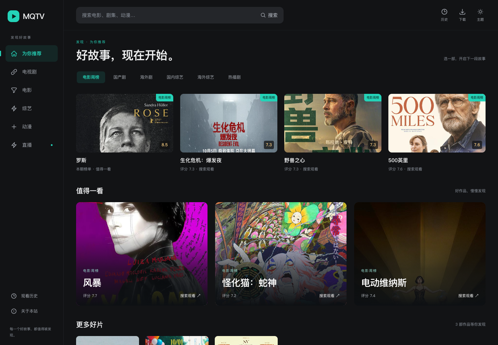
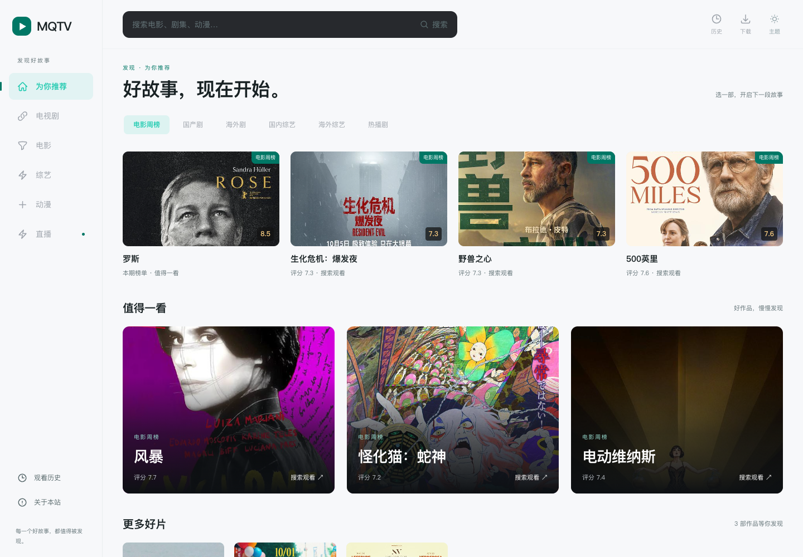
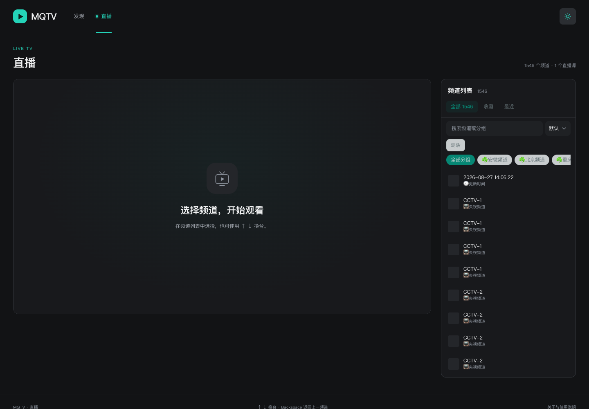
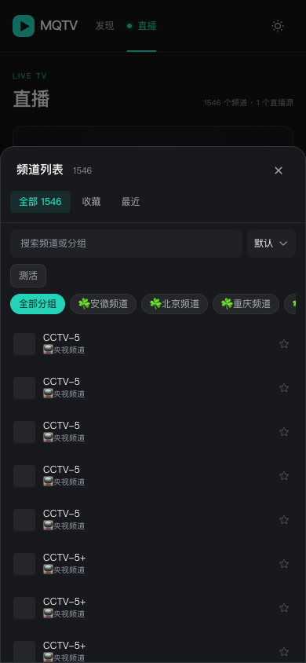

# MQTV

MQTV 是基于 [LibreSpark/LibreTV](https://github.com/LibreSpark/LibreTV) 二次开发的在线视频聚合搜索与观看应用，使用 Next.js 15（App Router）、React、TypeScript 和 Tailwind CSS，支持点播、直播与深浅主题。

本项目在 LibreTV 的基础上调整了首页、播放页和直播页，增加独立管理后台、统一源配置、资源目录定时刷新及项目内 Node drpyS 接入。MQTV 是独立维护的二次开发版本；原项目的官方站点、演示站和预构建镜像不代表本版本。

## 应用截图

以下为 MQTV 当前版本的本地浏览器截图。首页推荐和视频内容取决于部署者配置的数据源，截图不代表所有第三方接口持续可用。

### 首页 · 深色主题



### 首页 · 浅色主题



### 直播



### 手机首页与频道抽屉

<p>
  
  
</p>

## 二次开发说明

- **影院界面**：重新设计首页推荐、搜索结果、点播播放页和直播页，统一深浅主题与手机布局。
- **独立后台**：前台公开访问；管理员直接打开 `/admin`，使用服务器配置的 `ADMIN_KEY` 管理网站、数据源、订阅和统计。前台不展示管理入口。
- **统一资源目录**：点播与直播分别保存，按 URL 和 key 去重，保留同一源的全部订阅出处；持续运行的服务器每四天北京时间 05:00 刷新一次。
- **Node 解析能力**：保留 CMS 接口，支持公网 HTTP T4 接口和本地允许列表中的 drpyS 规则；首批接入央视公开点播。
- **数据与迁移**：全站配置保存到服务器持久目录，观看历史与播放进度保存在设备浏览器；提供配置备份恢复和旧格式迁移。

LibreTV 的来源说明和开源许可证继续保留。项目内仍使用部分 `libretv` 配置键、订阅格式和内部标识，以兼容已有数据。

## 核心特性

- **聚合搜索**：多采集站服务端并行搜索
- **跨源同名聚合**：同名影片合并为一张卡片，按首次返回顺序展示，点击直接进入播放详情页，在播放页自动选择可用线路并展示线路列表
- **HLS 播放**：ArtPlayer + hls.js，广告分片过滤、自动连播、倍速、快捷键、移动端长按 3 倍速
- **直播 / IPTV**：M3U 订阅解析，`/live` 页面按分组浏览、搜索频道并站内播放（HLS + HTTP-FLV），支持 XMLTV 节目单（EPG）与频道收藏；直播流经专用长连接代理（`/api/live/stream`）转发
- **进度同步**：播放进度与观看历史存于本机 IndexedDB，精确到秒的续播
- **换源测速**：跨源搜索同名资源并测速排序，一键切换保留集数位置
- **源测试与订阅**：一键探活点播源与直播源（支持批量测活）；搜索时自动记录各源健康度，连续失败的源按阶梯时长自动停用（30 分钟 → 24 小时 → 长期），可一键恢复；订阅远程源列表（一份 LibreTV-SourceList JSON 可同时下发点播源与直播源，也可直接填 TVBOX 配置地址，自动导入其中可直接使用的接口），可导出分享
- **首页推荐**：豆瓣（电影/剧集分类浏览）、Bangumi 新番放送表或影视榜单（豆瓣周榜 + 百度热播，经 60s API），后台「内容与播放」中切换；均服务端直连 + 缓存，Bangumi/榜单免 key 免配置（`60S_API_BASE` 可指向自部署 60s 实例）
- **PWA**：可安装到桌面 / 主屏幕，亮暗双主题无首屏闪烁

## 管理后台

前台不显示管理后台按钮或链接。请直接访问 `https://你的域名/admin`（本地为 `http://localhost:8080/admin`），输入服务器环境变量 `ADMIN_KEY` 中配置的管理密钥后进入。密钥可用 `openssl rand -hex 32` 生成；不要使用默认值或访客密码代替管理密钥。

- 管理页面验证成功前不请求管理数据；密钥仅保存在页面内存，刷新或退出后需要重新输入。
- 所有 `/api/admin/*` 请求必须携带 `Authorization: Bearer <ADMIN_KEY>`。无密钥或错误密钥返回 401；服务器未设置 `ADMIN_KEY` 返回 503。访客 Cookie、访客密码和免密码模式均不能授权管理接口。
- 后台按网站设置、内容与播放、点播源、直播源、配置订阅、资源目录、数据管理和访问统计分组。前台不再提供设置抽屉。
- 网站名称、简介、公告、成人内容过滤、首页推荐与来源、广告切片过滤、自动连播、视频缓存、封面直连/本站代理/自定义代理统一保存并下发。后台配置覆盖访客旧偏好，旧浏览器配置仍保留，可在数据管理中显式迁移到全站草稿。
- 数据源支持增删改、启停、排序、搜索筛选和批量检测；订阅由后台同步为源快照，沿用 TVBOX/LibreTV 解析和 SSRF 校验。支持公网 T4 接口及项目内 Node drpyS 规则；订阅提供的远程 JAR/JS/Python 文件仍不会自动执行。重新同步更新快照，关闭订阅后该订阅的源不再下发；检测或解析成功不代表已经验证播放。
- 数据管理支持全站配置备份恢复、源列表导出/公开链接发布、旧浏览器设置迁移、当前浏览器数据与观看历史恢复、缓存清理与自动停用源恢复。设备数据操作只影响当前浏览器。
- 编辑内容先进入草稿，点击「保存配置」后生效，访客刷新页面获取新配置。并发保存通过修订号拒绝旧页面覆盖。

部署时配置 `ADMIN_KEY=replace-with-your-generated-key`。前台永久免密码访问，旧 `PASSWORD`、`AUTH_DISABLED` 环境变量不会重新开启前台验证；后台不提供访客密码开关。

首次启动从现有 `DEFAULT_*` 环境变量初始化。保存后以服务端 `DATA_DIR/site-config.json` 为准（默认 `./data/site-config.json`），包括明确保存的空列表。通过环境变量预置的订阅需要在后台同步并保存。管理密钥不写入该文件或配置备份。

实际数据源、订阅目录及刷新快照不随 Git 仓库或镜像发布。私有目录运行时从 `DATA_DIR/tvbox-catalog.json` 读取，快照从 `DATA_DIR/source-presets.json` 读取；目录仅通过鉴权管理接口展示。没有这些文件且未设置 `DEFAULT_*` 时，首次启动源列表为空，可在后台添加或导入配置。测试使用虚构地址，不需要真实数据源。

快照采用版本 2：顶层 `sources` 和 `liveSources` 分别保存点播和直播源，`subscriptions` 保存入口及同步时间，`subscriptionUrls` 记录出处。按规范 URL 去重，直播查询参数和签名保持原样；key 由源类型和 URL 的 SHA-256 摘要生成。同一 URL 同时声明为点播和直播或 key 冲突时明确报错。

### 内置央视公开点播

「央视公开点播」是直接运行在现有 Node 服务中的内置适配器，以固定源地址 `https://search.cctv.com/ifsearch.php` 识别，支持官方公开搜索、官方视频页详情解析及公开 HLS 播放地址；沿用源管理的启停、检测、配置导入导出和分享链接。它是独立源，不替换 TVBOX 中 `csp_CCTV` / Python 条目的 `ext` 配置。没有增加运行依赖，也不需要 Cookie；接口标记受限或没有公开 HLS 时会明确失败。视频质量以上游普通 HLS 返回结果为准，部分视频仅提供标清。此接入不代表具备通用 Android JAR 或远程脚本执行能力。

### 项目内 Node drpyS 引擎

已接入固定版本 drpyS 核心，首批注册「央视公开点播（drpy）」规则，支持搜索、详情与选集播放解析。执行 `npm run drpy:install` 安装后，使用 `npm run dev:drpy` 或构建后的 `npm run start:drpy` 同时启动主站和引擎；引擎建议 Node 22，主站使用 Node 24 时设置 `DRPY_NODE_BIN` 指向 Node 22。联合启动自动生成内部密钥并启用托管源。Docker 设置 `DRPY_ENABLED=1` 和 `DRPY_API_KEY`，设置 `COMPOSE_PROFILES=drpy` 后拉取并启动镜像。安装、规则注册、支持边界和验证记录见 [Node 引擎接入说明](docs/drpy-integration.md)。

持续运行的生产 Node 服务（`npm run start` 或 Docker）自动启动目录定时器，默认每四天北京时间凌晨 05:00 刷新，固定锚点为 2026-10-09 05:00，下一批为 10 月 13、17、21 日，跨月也保持四天间隔。每分钟检查一次，实际启动可能比 05:00 延后最多约一分钟；重启不改变周期，停机错过执行时间时启动补跑一次。开发、测试和构建不启动任务；设置 `CATALOG_AUTO_SYNC=0` 可关闭。当前方案用于单实例、持续运行且有可写持久磁盘的部署，不适用于无服务器函数或多个副本同时写同一目录。

每轮访问目录中的全部不同配置地址，包括同一源 `subscriptionUrls` 中的所有入口，按四个入口并发抓取，复用现有 TVBOX / LibreTV 解析及公网地址校验；不执行订阅提供的远程 Spider。内置「央视公开点播」独立保留在点播列表，旧的持久化目录读取时也会加入，后台停用选择保持有效。两个入口返回同一接口时，合并成一个源对象并保留两个出处；一个入口失败时，继续使用另一个入口及失败入口上次成功的数据。刷新后原子写入 `DATA_DIR/source-presets.json`，执行报告写入 `DATA_DIR/source-sync-report.json`，其中记录各入口的成功、失败、旧数据保留情况及下次执行时间。全部入口失败时仅写报告，保留完整旧快照；同一周期不会因重启反复请求。刷新成功仅证明配置可拉取和解析，不保证所有接口可搜索或视频可播放。

已提供私有目录或快照，且首次启动未指定 `DEFAULT_SUBSCRIPTIONS` 时，通过一条「资源目录自动更新」订阅读取统一快照；有持久化快照时优先读取，无需访客浏览器抓取远程配置。已保存站点配置中的这条订阅每次读取时跟随刷新结果，保留管理员的名称、订阅开关及各源启停选择；关闭或删除它可停止向访客下发目录源。显式 `DEFAULT_SUBSCRIPTIONS` 替换默认目录订阅；保存为空也不会自动补回预置源。此前保存的各入口订阅仍由管理员单独管理，要切换为统一自动目录，可在后台「资源目录」点击「导入自动更新目录」并保存，按需要关闭此前的入口订阅。网站设置、手动源和其他订阅不会被定时任务修改。

Docker Compose 挂载持久化数据卷到 `/app/data`，默认实际卷名为 `mqtv-data`。迁移已有部署时，通过 `MQTV_DATA_VOLUME` 指定原来的实际卷名。镜像由本仓库 CI 构建，更新时保留数据卷。当前文件存储用于单实例、可写持久磁盘部署，不支持多个实例共同写入或无持久磁盘的平台。

页面入口本身不构成请求鉴权：合法密钥持有者也可以通过其他客户端调用管理接口。所有 `/api/admin/*` 以及管理操作 `/api/source/test`、`/api/source-list`、`/api/publish` 都校验 Bearer 密钥。前台搜索和播放公开可用；管理密钥应通过 HTTPS 传输。

### 浏览器访客统计

后台「访问统计」显示累计访客、今日新增、今日活跃、今日回访、近 30 天新增趋势与每日明细，读取接口 `/api/admin/visitors` 与其他管理接口一样必须携带管理员 Bearer 密钥。

前台首次可见访问使用 `crypto.randomUUID()` 生成随机 `ukey`，单独保存在 localStorage 的 `libretv-visitor-ukey`，不包含在配置导入导出中。每个标识每天只计一次活跃；服务端首次见到该标识时计入新增，后续日期的访问计入回访。日界线统一为北京时间（Asia/Shanghai），使用服务器时间，浏览器不能提交统计日期。后台页面不会生成标识或上报访问。

上报接口为公开的 `POST /api/visit`，只接受 `{ "ukey": "UUID-v4" }`，只返回上报日期，不返回统计或授予权限。服务端在 `DATA_DIR/visitor-events.jsonl` 追加保存标识的 SHA-256 哈希和日期，沿用已有持久化数据卷；同一标识当日的刷新、多标签页和路由切换会在服务端去重，不重复写入。请保留该文件；删除并重启服务会使累计与历史统计从零重新计算。全站配置备份不包含访客统计；备份统计需保留此数据文件。

浏览器标识没有人为设置的到期时间，但无法保证永久保存。清除站点数据、无痕窗口、新浏览器、设备或域名，以及浏览器主动清理数据，都可能产生新标识；多个人共享同一浏览器则可能被合并。持久化不可用时跳过上报，不生成一次性标识。统计的是新浏览器访客，从上线本模块后开始积累，不能还原历史真实用户，也不等同于注册用户数。公开接口不提供防刷保证，伪造新标识的脚本可能影响统计。

当前追加文件与进程内去重方案用于单实例持久磁盘部署；新增记录前台只上报标识，不收集页面路径、搜索词、播放内容或 IP。历史文件会随独立访客访问天数增长，统计读取会重建索引，适合当前单实例小站；大规模或多实例部署应迁移到带唯一约束的数据库存储。

## 首页与加载体验

首页采用左侧频道导航、顶部搜索栏和内容推荐区，默认炭黑与青绿色主题，与播放详情页共用深浅主题偏好；手机端导航改为横向频道栏。推荐仍读取后台选择的数据源，电影、电视剧、综艺与动漫入口按支持的榜单或分类获取真实内容，点击作品进入现有聚合搜索。

动效使用 `gsap` 与 `@gsap/react`：导航和查询期间显示顶部循环光带，完成后铺满并淡出，不伪造百分比。首屏配置与推荐等待使用对应布局的骨架，分类请求期间保留上一份内容，新内容就绪后短暂错落入场；封面就绪后淡入。GSAP 通过 `useGSAP` 与 `matchMedia` 清理动画，只动画透明度和位移，并遵循 `prefers-reduced-motion`。不设置人为等待时间。搜索来源在服务端并发请求，影片按首次返回顺序追加，同名同年份合并为一张卡片；后到来源与最终完成事件不重新排序。点击卡片立即进入 `/watch` 播放详情页，带入已找到的线路并补查其他线路；播放页并发请求详情，最先返回非空剧集的线路胜出，其他详情请求中止；线路列表与剧集列表在播放页直接展示，手动切线保留当前集数，结果区只显示影片数量，不展示逐源失败与来源选择。播放页沿用首页影院色板与品牌导航，以大播放器、影片信息和右侧线路/选集面板组成布局；线路与长剧集列表各自滚动，手机端面板放在播放器下方。

## 部署

### Docker 一键部署（当前源码）

在已安装 Docker Engine 和 Docker Compose v2 的服务器上，将项目放到部署目录后执行：

```bash
bash scripts/deploy-docker.sh
```

默认映射 **服务器 `18080` → 容器 `8080`**，监听所有服务器网卡，不占用服务器的 8080。前台地址为 `http://服务器IP:18080`，后台直接访问 `http://服务器IP:18080/admin`。需要其他端口时：

```bash
bash scripts/deploy-docker.sh 19080
```

首次运行生成权限为 `600` 的 `.env`，自动生成独立 `ADMIN_KEY`、`DRPY_API_KEY` 与 `PROXY_SECRET`，并开启 drpy。后台登录密钥在服务器 `.env` 的 `ADMIN_KEY` 字段中，不在部署日志中打印。已有 `.env` 会复用，传入端口只更新 `HOST_PORT`；未填写必要密钥时明确报错。主站与解析服务均从当前源码构建，宿主机无需安装 Node 或 Python；首次 drpy 构建需要连接 GitHub 下载固定版本引擎。

更新程序时，更新源码后重复执行相同命令。默认持久卷为 `mqtv-data`，已有部署请先将 `.env` 中的 `MQTV_DATA_VOLUME` 改成原来的实际卷名。脚本不会删除数据卷或停止其他服务；所选端口已被占用时 Docker 会报错，需换一个端口重试。服务器防火墙和云安全组需要放行所选 TCP 端口；脚本不自动修改防火墙。drpy 的 5757 只在容器网络内开放。

全新数据卷没有私有源配置。部署后管理员通过 `/admin` 添加数据源、订阅或导入配置；已有数据卷中的配置继续保留。主站及启用的解析服务健康检查通过后才报告成功。详细说明见 [部署文档](docs/deployment.md)。

### 发布镜像与自动部署

GitHub 仓库为 [MaoLikeQvQ/MQTV](https://github.com/MaoLikeQvQ/MQTV)。推送 `main` 后自动检查、构建并发布主站和 drpy 镜像；配置部署 Secrets 并启用 `DEPLOY_ENABLED` 后，通过 SSH 拉取本次镜像并等待健康检查，失败时尝试回退上次部署。

服务器首次只需要上传 `docker-compose.prod.yml`（在服务器保存为 `docker-compose.yml`）和私有 `.env`，无需源码、Dockerfile 或 Node。实际数据源由管理员在后台导入，或单独放入服务器数据卷；代码更新不覆盖这些配置。详细设置、私有镜像登录、已有卷迁移与失败恢复见 [CI/CD 部署说明](docs/deployment.md)。

```bash
# 首次部署，已有 .env 时不要覆盖
cp .env.example .env
# 编辑 .env，配置 ADMIN_KEY 和 PROXY_SECRET
# 启用引擎：DRPY_ENABLED=1、DRPY_API_KEY、COMPOSE_PROFILES=drpy

docker compose -f docker-compose.prod.yml pull
docker compose -f docker-compose.prod.yml up -d --no-build --wait --wait-timeout 120
```

默认镜像为 `ghcr.io/maolikeqvq/mqtv:latest` 和 `ghcr.io/maolikeqvq/mqtv-drpy:latest`，须先由本仓库 Actions 发布；原项目镜像不包含 MQTV 的修改。自动部署固定镜像摘要，不使用浮动的 latest。当前 CI 发布 `linux/amd64` 镜像。

`docker-compose.prod.yml` 专用于拉取发布镜像。现有 `docker-compose.yml` 保留给本地源码构建流程，不用于 Actions 自动部署。服务器将生产文件保存为 `docker-compose.yml` 后，命令无需 `-f`。

管理后台对外部署请使用 HTTPS，保护请求携带的管理密钥。版本号以 `package.json` 为准，健康检查 `/api/health` 仅返回就绪状态与版本，不返回数据源或凭证。

### 手动运行

```bash
npm install
npm run build
ADMIN_KEY=replace-with-your-generated-key npm start   # 监听 8080
```

### 环境变量

| 变量 | 必填 | 说明 |
| --- | --- | --- |
| `PASSWORD` | 否 | 旧版兼容变量，当前前台不再使用访问密码 |
| `HOST_PORT` | 否 | Docker 服务器映射端口，默认 `18080`；容器内仍为 `8080` |
| `HOST_BIND` | 否 | Docker 端口监听地址，默认 `0.0.0.0`，可改为 `127.0.0.1` 供同机反向代理使用 |
| `MQTV_DATA_VOLUME` | 否 | Docker 持久卷实际名称，默认 `mqtv-data`；迁移时指定原来的卷名 |
| `ADMIN_KEY` | 管理功能必填 | 独立管理密钥，每次管理请求通过 Bearer 请求头校验 |
| `AUTH_DISABLED` | 否 | 旧版兼容变量，当前前台始终免密码 |
| `DATA_DIR` | 否 | 服务端全站配置目录，本地默认 ./data，Docker 默认 /app/data |
| `PROXY_SECRET` | 否 | 会话/代理签名密钥；不设置时从 PASSWORD 派生（多实例部署建议显式设置） |
| `DEFAULT_SOURCES` | 否 | 预置采集站（JSON 数组），用户端自动出现且默认勾选，详见[配置文档](https://libretv.is-an.org/wiki/Configuration.html) |
| `REQUEST_TIMEOUT` | 否 | 代理上游请求超时（毫秒），默认 8000 |
| `MAX_RETRIES` | 否 | 代理请求重试次数，默认 1 |
| `SEARCH_MAX_PAGES` | 否 | 每个搜索源最多抓取的页数（1-50，默认 5）。第一页会读取源站 `pagecount`，实际页数 = min(源站总页数，该值)；页间并行请求，单页失败只丢该页 |
| `SEARCH_SOURCE_TIMEOUT_MS` | 否 | 单个搜索源的总死线（毫秒，3s-60s，默认 10000）：该源所有分页请求须在时限内完成，到点中断并将其标记为「超时」；健康度自动停用也以此为超时判定依据 |
| `USER_AGENT` | 否 | 代理请求使用的 UA（豆瓣封面防盗链等场景），默认 Chrome UA |
| `FALLBACK_CORS_PROXY` | 否 | 豆瓣推荐数据直连被拒时降级使用的 CORS 代理地址 |
| `COOKIE_SECURE` | 否 | 显式覆盖会话 cookie 的 `Secure` 标记（`true` / `false`）；默认按请求协议自动推导。反向代理未正确传递 `x-forwarded-proto` 导致 HTTPS 下登录失效时，设为 `true` 可解 |
| `60S_API_BASE` | 否 | 影视榜单推荐源（60s API）实例地址，默认 `https://60s.crystelf.top`；有限流，高频使用可[自部署](https://github.com/vikiboss/60s) |
| `DEFAULT_LIVE_SOURCES` | 否 | 预置直播源（M3U 订阅），JSON 数组：`[{"name":"源名","url":"https://.../list.m3u","epg":"https://.../epg.xml.gz"}]`，`epg` 为可选的 XMLTV 节目单地址 |
| `DEFAULT_SUBSCRIPTIONS` | 否 | 预置数据源订阅（LibreTV-SourceList JSON 链接，也接受 TVBOX 配置地址），JSON 数组：`["https://.../sources.json", {"url":"https://.../list.json","name":"名称"}]`。初始化后台订阅，需管理员同步并保存快照 |
| `DEFAULT_RECOMMEND_SOURCE` | 否 | 首页推荐数据源的默认值（`douban` / `bangumi` / `hot-list`，出厂默认 `hot-list`）；初始化后台推荐来源，保存后以后台配置为准 |
| `LIVE_ALLOW_PRIVATE` | 否 | 设为 `1` 时允许直播流代理访问内网/保留地址（自建 IPTV 场景），默认关闭以维持 SSRF 防护 |

## 使用说明

1. **添加点播源**：管理后台 → 点播源 → 添加点播源，填入 Apple CMS 采集站地址（如 `https://example.com/api.php/provide/vod`），可选填详情页地址（部分源需要爬详情页提取播放地址）。
2. **搜索**：勾选点播源后输入片名；搜索通过服务端聚合，个别源失败不影响整体结果。
3. **播放**：点击搜索结果进入 `/watch`，在播放页选择线路和剧集；支持快捷键（空格/←→/↑↓/F/Alt+←→）、移动端长按 3 倍速、自动连播、换源测速。观看/暂停时后续分片自动缓存到本地（后台「内容与播放」中可关闭），播放页可「下载本集」（TS/MP4）离线观看。
4. **进度与历史**：自动保存在本设备 IndexedDB，仅定位信息入库，播放时自动同步最新剧集。
5. **配置迁移**：管理后台 → 数据管理（兼容旧版 LibreTV-Settings JSON 的历史记录迁移）。

## 直播 / IPTV

1. **添加直播源**：管理后台 → 直播源 → 填入 M3U/M3U8 地址（可选填 XMLTV 节目单地址），添加后可检测列表并显示频道数量，保存后全站生效；也可在「管理后台 → 配置订阅」中与点播源一起订阅导入；部署者还可用 `DEFAULT_LIVE_SOURCES` 环境变量预置。
2. **观看**：进入「直播」页，按分组标签筛选或搜索频道，点击即播；支持 HLS（m3u8）与 HTTP-FLV 两种直播流，直连失败自动走代理通道重试。
3. **节目单**：频道带 `tvg-id` 且订阅配置了 EPG 地址时，展示当前/接下来节目与播放进度。
4. **收藏与导出**：频道可收藏；订阅可一键导出为标准 M3U 文件，供 PotPlayer / VLC 等外部播放器使用。

完整说明见 [直播 / IPTV 文档](https://libretv.is-an.org/wiki/Live-IPTV.html)。

> 项目不附带实际数据源或私有解析快照，也不存储、不制作任何直播内容。列表可解析不代表频道可播放，部署者可在后台启停或替换直播源。内网自建源默认被 SSRF 防护拦截，自部署者可显式设置 `LIVE_ALLOW_PRIVATE=1` 放行。

## 数据源订阅 / 分享

### MQTV 资源目录

「管理后台 → 资源目录」收录了 2026-10-09 从 [Zoo.ink](https://zoo.ink/tvbox.html) 提取的优选接口 10 条、备用接口 27 条，共 37 个规范化后不同的配置地址。跨分类重复条目已合并，分类、名称、说明和地址保存在 `src/lib/tvbox-catalog.json`；说明为来源页面描述，不代表已验证可用性。

目录支持分类筛选、名称/说明/地址搜索和复制。点击「检查并导入」会通过现有鉴权订阅接口读取配置，仅导入支持的点播接口和直播源；成功后可在源管理中启停、同步或删除。操作结果展示导入数量、跳过原因或请求错误，失败时可重试。目录不会在页面加载时自动请求第三方配置，也不运行远程 JAR 插件。重复地址复用同一后台订阅。点击「导入自动更新目录」可改用服务器定时刷新的统一源列表；入口目录来自项目文件，定时任务不抓取 Zoo.ink 网页来发现新增入口。

导入成功仅表示配置解析并写入成功，实际搜索和浏览器播放仍需验证。启动和验证命令沿用下方开发说明。

数据源（点播源 + 直播源）可以 **导出为一份 JSON → 托管到公开 URL → 他人在「管理后台 → 配置订阅」里填入该 URL 订阅**。

托管地址没有特殊要求，可用 [npoint.io](https://www.npoint.io/) 免费托管 JSON（粘贴内容即可得到一个公开 URL），Gist、对象存储、任意静态托管同样可用。

### 订阅格式（LibreTV-SourceList JSON）

```json
{
  "name": "我的源列表",
  "version": 2,
  "sources": [
    {
      "name": "示例点播源",
      "url": "https://example.com/api.php/provide/vod",
      "detail": "https://example.com",
      "isAdult": false
    }
  ],
  "liveSources": [
    {
      "name": "示例直播源",
      "url": "https://example.com/list.m3u",
      "epg": "https://example.com/epg.xml.gz"
    }
  ]
}
```

**字段说明**：

| 字段 | 位置 | 类型 | 必填 | 说明 |
| --- | --- | --- | --- | --- |
| `name` | 顶层 | string | 否 | 列表名称，订阅后显示在订阅条目上；缺省时显示订阅地址主机名 |
| `version` | 顶层 | number | 否 | 格式版本，当前为 `2`（新增 `liveSources`）；导入端目前忽略该字段 |
| `sources` | 顶层 | array | 否 | **点播源**数组（Apple CMS 采集站），最多 100 个，超出部分截断 |
| `sources[].name` | 项 | string | 否 | 源显示名；缺省时使用 URL 主机名 |
| `sources[].url` | 项 | string | **是** | Apple CMS 采集接口地址（公网 http/https），结尾 `/` 自动去除 |
| `sources[].detail` | 项 | string | 否 | 详情页根地址，用于列表接口拿不到播放地址、需要爬详情页提取 m3u8 的源 |
| `sources[].isAdult` | 项 | boolean | 否 | 成人内容标记，默认 `false`。标记为 `true` 的源名称旁显示 **(18+)** 徽章；后台「内容与播放」中的「成人内容过滤」开启（默认开启）时该源不可勾选、不参与搜索，需先关闭过滤才能启用 |
| `liveSources` | 顶层 | array | 否 | **直播源**数组（M3U 播放列表），最多 50 个，超出部分截断 |
| `liveSources[].name` | 项 | string | 否 | 源显示名；缺省时使用 URL 主机名 |
| `liveSources[].url` | 项 | string | **是** | M3U 播放列表地址（http/https） |
| `liveSources[].epg` | 项 | string | 否 | XMLTV 节目单地址（`xml` / `xml.gz`），用于 `/live` 页展示节目单；地址非法时只丢弃该字段、保留整条源 |

**兼容与限制**：

- 只写 `sources` 的老订阅照常可用（纯点播），只写 `liveSources` 则是纯直播订阅；两者都缺时提示「订阅内容格式不正确」；裸数组 `[{ "name": "...", "url": "..." }]` 视为点播源；
- 按 `url` 去重（先到先得）；非 http(s) 地址会被过滤；**点播源**另需为公网地址（内网/回环/保留地址会被静默过滤），**直播源**在部署者设置 `LIVE_ALLOW_PRIVATE=1` 时可使用内网自建源地址；
- 订阅由**服务端**拉取（拉取前经过 SSRF 校验），因此订阅地址**无需配置 CORS**，Gist、对象存储、任意静态托管均可。

### 兼容 TVBOX 配置

订阅地址也可以直接填 **TVBOX 配置**（形如 `{"sites": [...], "lives": [...], "parses": [...]}`）：服务端按内容结构自动识别格式，无需手动选择。

- **点播源**：导入 `sites` 中 `type: 1` 的 JSON 接口（即 Apple CMS 采集站）；部分共享配置省略 `type` 或写成 `0`，但地址命中 `api.php/provide/vod` 时同样导入；站点自身标记 `searchable: 0`（不可搜索）时跳过；
- **直播源**：导入 `lives` 中 `type: 0`（或省略）的 M3U 播放列表，`epg` 字段一并带上；txt 频道列表与单仓 JSON 不支持；
- **远程 Spider 类站点会跳过**：`type: 3` 的 Spider（`csp_*` / `.jar` / `.js` / `.py`）依赖对应的执行引擎，当前不运行这些远程插件；XML 接口仍不支持；`type: 4` 的 HTTP T4 接口现可导入。被跳过的条目不影响其余导入，导入结果会如实提示，如「已同步 8 个点播源、2 个直播源（TVBOX 配置）；跳过 96 个不可用条目（Spider 引擎 92、XML 接口 4）」；
- TVBOX 配置常含上百条站点且以 Spider 为主，**只导入个位数到十几个属正常现象**；
- **格式容错**：配置里的 `//` 注释、尾随逗号、字符串内未转义的换行会自动修正后再解析（共享配置中很常见，TVBOX 客户端用的 fastjson 同样容忍这些写法）；
- 其他限制：订阅地址需直接返回 JSON（Base64 / 压缩包装的分享链接不支持）；TVBOX「多仓」配置（顶层为 `urls` 数组）不支持，请填单仓配置；地址公网校验、去重与数量上限与上方格式完全一致。

### 订阅行为

- **订阅与同步**：管理后台 → 配置订阅 → 添加名称和地址 → 同步订阅 → 保存配置。重新同步整体替换该订阅的源快照，并保留相同地址的标识与启停状态。
- **管理边界**：访客只收到已启用的源快照，不收到订阅链接，也不在浏览器中自动同步。关闭或删除订阅后不再下发其源；同一地址被另一个已启用订阅或手动源引用时仍可使用。收藏和观看历史保留在设备中。
- **导出分享**：后台数据管理可导出已启用源，或经确认发布到第三方公开粘贴板（paste.rs，失败降级 0x0.st）。生成的内容公开可读，每次发布生成新链接；长期稳定链接可自行托管导出的 JSON。

> 订阅由服务端拉取（经过 SSRF 校验），因此订阅地址无需配置 CORS。完整说明见 [数据源文档](https://libretv.is-an.org/wiki/Data-Sources.html)。

## 开发

```bash
npm install
ADMIN_KEY=replace-with-your-generated-key npm run dev   # http://localhost:8080
npm test                            # 核心库单元测试（cms-parser / m3u8 / ssrf）
npm run typecheck
```

上游开发资料可参考 [LibreTV 开发文档](https://libretv.is-an.org/wiki/Development.html)；MQTV 的构建与运行命令以本仓库为准。

## 安全说明

- 管理密钥由服务器环境变量配置，后台登录后在页面内存中保存，管理请求通过 Bearer 请求头验证；前台不再要求访问密码。
- 登录接口有 IP 速率限制（10 次 / 10 分钟）。
- 代理内置 SSRF 防护：拒绝内网/保留地址（含 DNS 解析后校验），仅放行 http(s)。
- 前台搜索与播放接口公开访问；管理接口始终单独校验管理密钥，隐藏页面入口不替代鉴权。

## 上游生态参考

| 项目 | 说明 |
| --- | --- |
| [OrionTV](https://github.com/orion-lib/OrionTV) | Apple TV / Android TV 客户端（React Native TVOS + Expo），配合 MoonTV 使用 |
| [LunaTV](https://github.com/MoonTechLab/LunaTV) | 影视聚合站（Next.js），支持 Redis / Upstash 等多存储后端 |
| [Selene-TV](https://github.com/MoonTechLab/Selene-TV) | Android TV（Leanback）客户端，Kotlin + Compose，对接 MoonTV / Helios |
| [EchoTV](https://github.com/hoowhoami/EchoTV) | Flutter 全平台客户端（已归档） |
| [WarHutTV](https://github.com/OuOumm/WarHutTV) | Go + React 的自托管影视聚合站 |
| [DecoTV](https://github.com/Decohererk/DecoTV) | 聚合播放站（原 KatelyaTV） |
| [Joyflix](https://github.com/jeffernn/Joyflix-Mac-Objective-C) | macOS 原生影视聚合客户端（Objective-C） |
| [MoonCakeTV](https://github.com/MoonCakeTV/MoonCakeTV) | 影视聚合搜索站（Next.js），文件存储、一键脚本部署 |
| [OrangeTV](https://github.com/djteang/OrangeTV) | 跨平台影视聚合播放器（Next.js），Kvrocks/Redis/Upstash 多存储与多端同步 |

> 旧版 LibreTV（静态 HTML + Express）完整代码见 [backup-2025 分支](https://github.com/LibreSpark/LibreTV/tree/backup-2025)。

## 致谢与许可证

- **[LibreSpark/LibreTV](https://github.com/LibreSpark/LibreTV)**：MQTV 的原项目，提供聚合搜索、播放器、直播解析与服务端代理等基础能力。感谢原作者及贡献者；MQTV 在其基础上进行二次开发，并非原项目官方发行版。
- **[ArtPlayer](https://github.com/zhw2590582/ArtPlayer)、[hls.js](https://github.com/video-dev/hls.js)、[mpegts.js](https://github.com/xqq/mpegts.js)**：播放器与流媒体支持。
- **[Hululu007/drpy-node](https://github.com/Hululu007/drpy-node)**：可选 Node drpyS 引擎的上游来源。固定版本与许可证记录见 [NOTICE](services/drpy/upstream/NOTICE.md) 和 [COPYING](services/drpy/upstream/COPYING)。
- **[vikiboss/60s](https://github.com/vikiboss/60s)**：影视榜单接口支持。

MQTV 保留原项目的 **AGPL-3.0** 许可证，全文见 [LICENSE](LICENSE)。项目引入的第三方组件遵循各自许可证；分发与修改时请保留对应的版权和许可声明。

## 免责声明

本项目不存储、不制作任何视频内容，仅提供第三方公开接口的聚合与播放能力，内容的合法性由对应数据源负责。

原项目作者的支持入口：[AFDIAN](https://afdian.com/a/veehub)。
